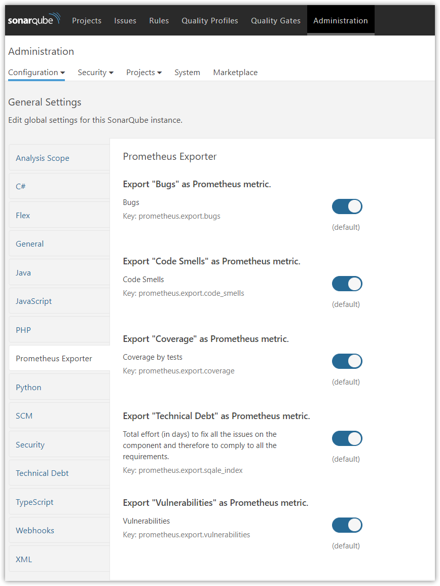
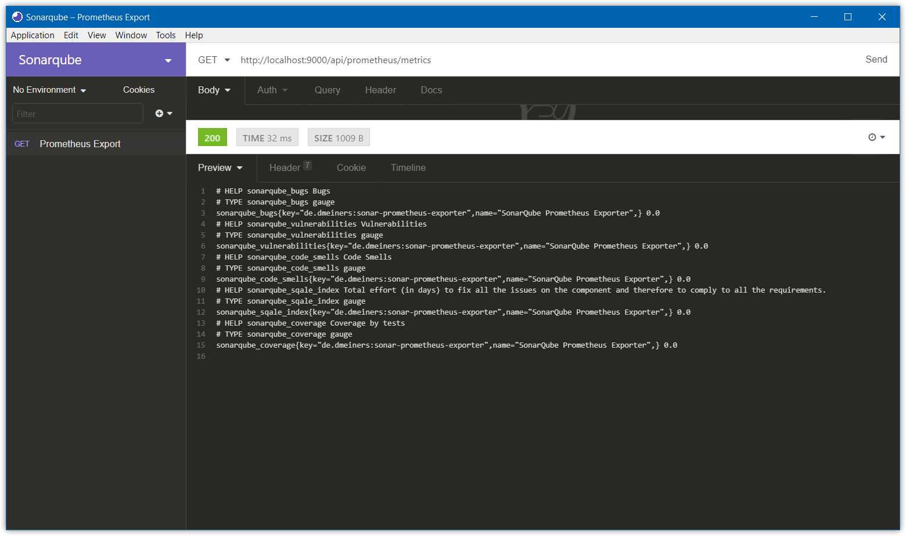
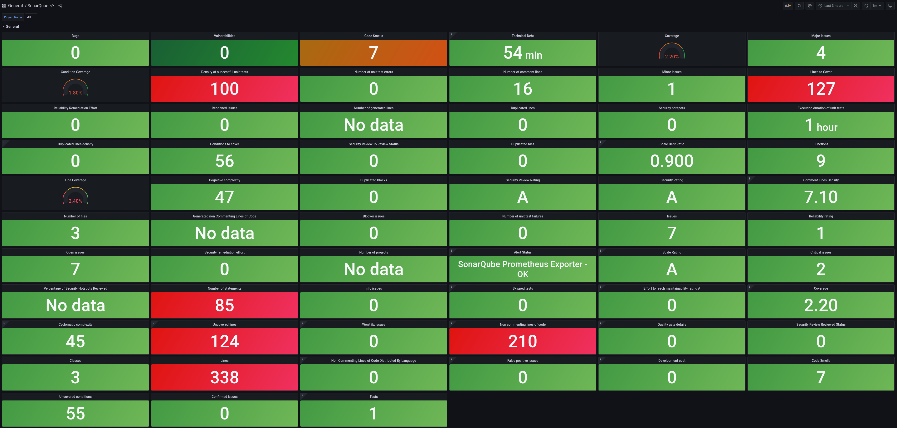
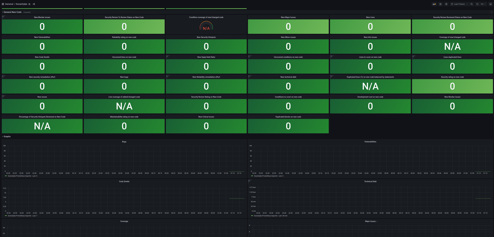

<h1 align="center">Sonarqube Prometheus Exporter</h1>
<h4 align="center">Prometheus Exporter Plugin for SonarQube.</h4>

<p align="center">
  <a href="https://travis-ci.com/juaalta/sonarqube-prometheus-exporter">
    
  </a>
  <a href="https://sonarcloud.io/dashboard?id=de.dmeiners%3Asonar-prometheus-exporter">
    
  </a>
  <a href="https://github.com/juaalta/sonarqube-prometheus-exporter/releases">
    
  </a>
  <a href="https://github.com/juaalta/sonarqube-prometheus-exporter/blob/develop/LICENSE">
    
  </a>
  <a href="https://semver.org/spec/v2.0.0.html">
    
  </a>
</p>

<p align="center">
  <a href="#information">Information</a> •
  <a href="#features">Features</a> •
  <a href="#requirements">Requirements</a> •
  <a href="#installation">Installation</a> •
  <a href="#usage">Usage</a> •
  <a href="#screenshots">Screenshots</a>
</p>

## Information

This plugin is a fork of [dmeiners88 / sonarqube-prometheus-exporter](https://github.com/dmeiners88/sonarqube-prometheus-exporter), as I have seen that the repository has been stopped for a long time, I will evolve in this repository the plugin.


## Features
* Configure which metrics to export

## Requirements
* SonarQube 8.x

## Installation

1. Download [latest snapshot release](https://github.com/juaalta/sonarqube-prometheus-exporter/releases/tag/v1.0.0-SNAPSHOT-2018-07-04)
2. Drop `sonar-prometheus-exporter-1.0.0-SNAPSHOT.jar` into `$SONARQUBE_HOME/extensions/plugins`.
3. Restart the SonarQube server.

## Usage

1. Configure which metrics you want to export under Administration &rarr; Configuration &rarr; General Settings &rarr; Prometheus Exporter
2. Add a scrape config to your Prometheus instance similar to this:
```yaml
scrape_configs:
  - job_name: 'sonarqube'
    metrics_path: '/api/prometheus/metrics'
    static_configs:
      - targets: ['localhost:9000']
```
3. Alternatively, point your HTTP client to `http://localhost:9000/api/prometheus/metrics`

## Screenshots
<p align="center">
  
  
  
  
</p>


## Local plugin testing

In order to test the plugin locally, a file has been created for docker-compose which starts the following docker programs:

* Sonarqube 8.9-community
* Prometheus 2.30.1
* Grafana 8.1.5

### Previous requirements

The previous steps to be able to test the plugin are the following:

* Install `docker` and` docker-compose`, if they are not.
* Generate the jar file, using the following command: `mvn clean package`
* Make sure the volume mounted inside the docker-compose points to the correct jar filename (the one generated in the previous step).
* Launch the following command: `sudo sysctl -w vm.max_map_count = 262144`, this command is necessary to start the internal Elasticsearch of Sonarqube.

### Test execution

To run the test, you must enter the docker folder and execute the following command: `docker-compose up -d` or` docker compose up -d`, depending on the docker-compose installation performed.

Access to the applications is as follows:

* Sonarqube: http://localhost:9000/projects
* Information exported by the plugin for prometheus: http://localhost:9000/api/prometheus/metrics
* Prometheus: http://localhost:9090/graph
* Grafana: http://localhost:3000/


In order to view data from Sonarqube, you can add the current project, using the command `mvn sonar: sonar -Dsonar.host.url = http: // localhost: 9000 -Dsonar.login = <sonarqube user token>`, it is recommended launch it at least 2 times, in this way all the data can be displayed.
